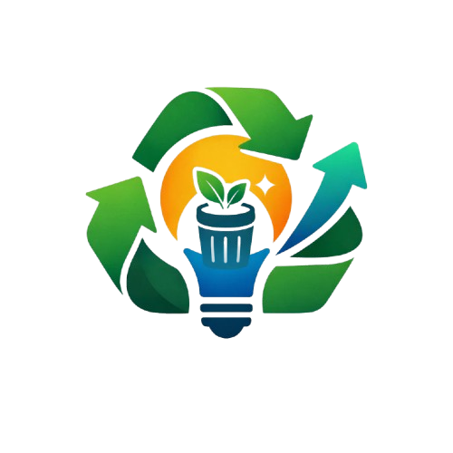

<div align="center">


## Trashform


Aplikasi analisis sampah menggunakan AI untuk mengidentifikasi jenis sampah dan memberikan rekomendasi daur ulang/upcycling dengan 

## 🚀 Fitur

- **Analisis Gambar**: Upload foto sampah untuk analisis otomatis
- **AI Gemini**: Menggunakan Google Gemini AI untuk identifikasi akurat
- **Rekomendasi**: Saran daur ulang dan upcycling
- **Responsive**: Interface yang mudah digunakan di desktop dan mobile

## 🛠️ Tech Stack

- **Frontend**: React + TypeScript + Vite + Tailwind CSS
- **Backend**: FastAPI + Python
- **AI**: Google Gemini AI
- **Icons**: Lucide React

## 📋 Prerequisites

- Python 3.8+
- Node.js 16+
- Google AI API Key

## 🚀 Quick Start

### 1. Clone Repository
```bash
git clone <repository-url>
cd waste-analysis-app
```

### 2. Setup Backend
```bash
# Install dependencies
pip install -r requirements.txt

# Setup environment
cp backend/.env.example backend/.env
# Edit .env and add your GOOGLE_API_KEY
```

### 3. Setup Frontend
```bash
cd frontend
npm install
```

### 4. Run Application

**Terminal 1 - Backend:**
```bash
cd backend
python main.py
```
Server akan berjalan di `http://localhost:8000`

**Terminal 2 - Frontend:**
```bash
cd frontend
npm run dev
```
App akan berjalan di `http://localhost:5173`

### 5. Test Application
1. Buka `http://localhost:5173` di browser
2. Upload foto sampah
3. Tunggu analisis AI (10-30 detik)
4. Lihat hasil analisis lengkap

## 📁 Project Structure

```
waste-analysis-app/
├── backend/
│   ├── main.py          # FastAPI server
│   └── .env            # Environment variables
├── frontend/
│   ├── src/
│   │   ├── App.tsx     # Main React component
│   │   ├── main.tsx    # React entry point
│   │   └── index.css   # Global styles
│   ├── package.json
│   └── vite.config.ts
├── requirements.txt     # Python dependencies
└── .gitignore
```

## 🔧 Configuration

### Environment Variables

**Backend (.env):**
```
GOOGLE_API_KEY=your_google_ai_api_key_here
```

**Frontend (.env):**
```
VITE_API_URL=http://localhost:8000
```

## 📊 API Endpoints

- `GET /` - Health check
- `POST /analyze` - Analyze waste image

## 🤝 Contributing

1. Fork the repository
2. Create your feature branch (`git checkout -b feature/AmazingFeature`)
3. Commit your changes (`git commit -m 'Add some AmazingFeature'`)
4. Push to the branch (`git push origin feature/AmazingFeature`)
5. Open a Pull Request

## 🙏 Acknowledgments

- Google Gemini AI for image analysis
- FastAPI for the backend framework
- React & Vite for the frontend
- Tailwind CSS for styling
